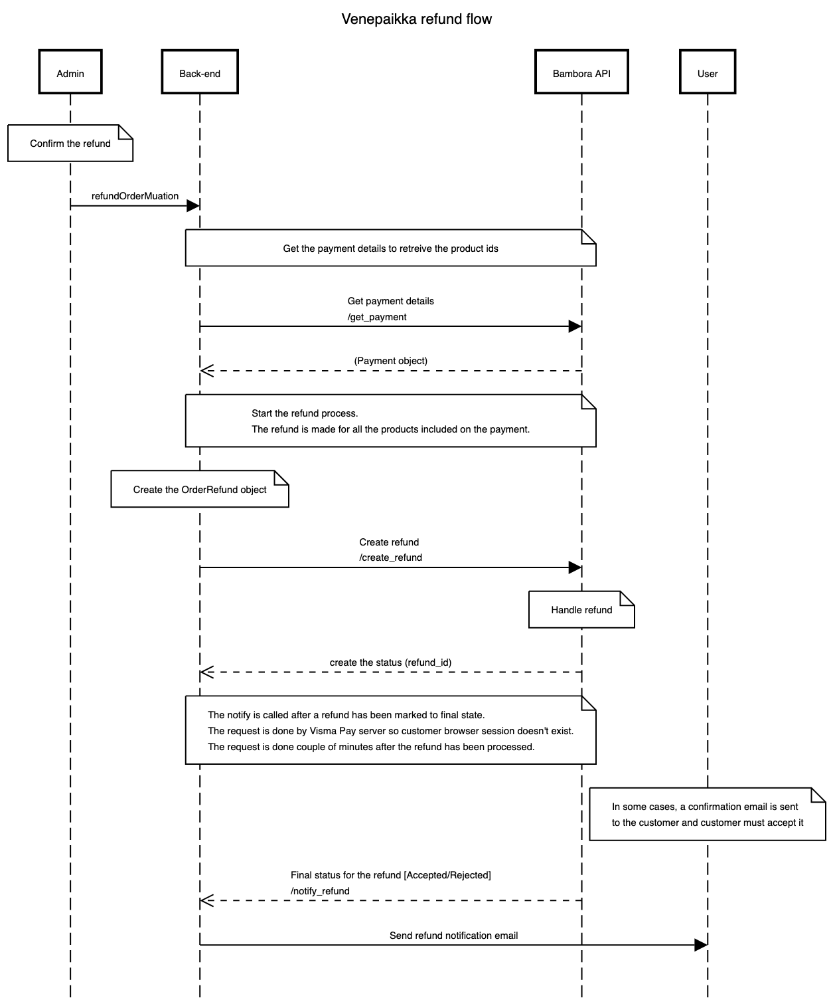

# Payments

The Venepaikka payments rely mostly on the [Respa](https://github.com/City-of-Helsinki/respa/blob/develop/docs/payments.md) implementation, however, changes were made to adapt it to the requirements of the project.

## Configuring Payments

There are a couple of required configuration keys that need to be set in order to enable the payments and the third party provider currently in use:

- `VENE_PAYMENTS_PROVIDER_CLASS`: Dotted path to the active provider class as a string. The default value is `payments.providers.BamboraPayformProvider`.

`./manage.py expire_too_old_unpaid_orders` runs the order/reservation cleanup for current orders. You'll probably want to run it periodically at least in production. [Cron](https://en.wikipedia.org/wiki/Cron) is one candidate for doing that.

### Bambora Payform configuration

The Bambora API version the provider implementation targets is `w3.1`. More information about the API can be found in [Bambora's official API documentation](https://payform.bambora.com/docs/web_payments/?page=full-api-reference) page.

In addition to the general configuration keys mentioned in the previous section, enabling Bambora also requires some extra configuration to function:

- `VENE_PAYMENTS_BAMBORA_API_URL`: Optionally override the base URL where Bambora requests are sent. Defaults to the documented Bambora endpoint.
- `VENE_PAYMENTS_BAMBORA_API_KEY`: Identifies which merchant store account to use with Bambora. Value can be found in the merchant portal. Provided as a string. No default value.
- `VENE_PAYMENTS_BAMBORA_API_SECRET`: Used to calculate hashes out of the data being sent and received, to verify it is not being tampered with. Also found in the merchant portal and provided as a string. No default value.
- `VENE_PAYMENTS_BAMBORA_PAYMENT_METHODS`: An array of payment methods to show to the user to select from e.g.`['nordea', 'creditcards']`. Full list of supported values can be found in [the currencies section of](https://payform.bambora.com/docs/web_payments/?page=full-api-reference#currencies) Bambora's API documentation page.

## Payment flow

## Refund flow

