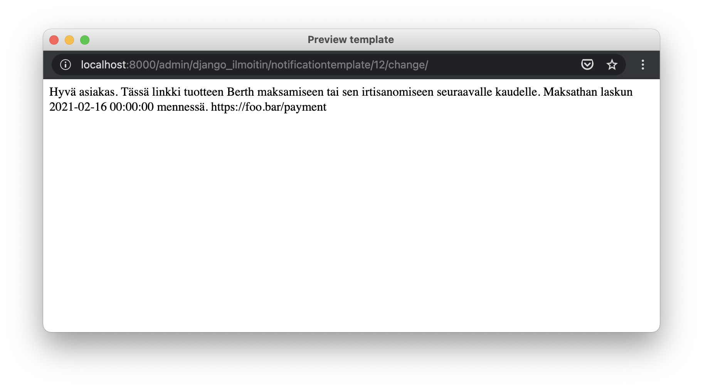

# SMS Notifications

The [`SMSNotificationService`](https://github.com/City-of-Helsinki/berth-reservations/blob/master/customers/services/sms_notification_service.py)
is a wrapper on top of the [Notification service API](https://github.com/City-of-Helsinki/notification-service-api/).
It uses [`django-ilmoitin`](https://github.com/City-of-Helsinki/django-ilmoitin/) both for storing and parsing message templates.

## Configuration
The service requires three environment variables:
* `NOTIFICATION_SERVICE_API_URL`: depending on the environment, the urls can be found on the
  [Notification service API](https://github.com/City-of-Helsinki/notification-service-api/) documentation
* `NOTIFICATION_SERVICE_TOKEN`: has to be manually generated by someone with access to the `NSAPI` django admin
    * The actual values can be found on the `Secrets` repo
* `NOTIFICATION_SERVICE_SENDER_NAME`: for now it's always `Hel.fi`

```dotenv
NOTIFICATION_SERVICE_API_URL=
NOTIFICATION_SERVICE_TOKEN=
NOTIFICATION_SERVICE_SENDER_NAME=Hel.fi
```

## Adding a new SMS 
To add a new SMS template:
1. Add the corresponding notification type:
```python
class NotificationType(TextChoices):
    SMS_TEMPLATE_TYPE = ("sms_notice_type", _("[SMS] Notice Type"))
```
2. Add the template to the `templates/sms/` directory
3. Add the notification type and filename to the `sms_notifications`
   on the `load_notification_templates.py` script
```python
sms_notifications = {
    NotificationType.SMS_TEMPLATE_TYPE: "template_name_{lang}.txt",
}
```
4. Run the `python ./scripts/load_notification_templates.py`

## Sending an SMS
The service takes care of parsing the template and generating the appropriate message to be sent.
In case no language is passed, it uses the system default (Finnish).
```python
sms_service = SMSNotificationService()
sms_context = {}

sms_service.send(
    NotificationType.SMS_TEMPLATE_TYPE,
    sms_context,
    phone_number,
    language=language,
)
```

### Plain text SMS
The service also supports sending "plain" text messages, i.e. just the message without using any template.
```python
sms_service = SMSNotificationService()

sms_service.send_plain_text(phone_number, "Message to send")
```

## Previewing an SMS
Since the service uses `django-ilmoitin` to store the messages, it can also be used to preview them
and see that the correct values are rendered.

The script loads the message as `body_html` only to be used for the preview.

1. Go to the Notifications section on the Django admin
2. Open an SMS notification
3. Scroll to the bottom and open the preview

